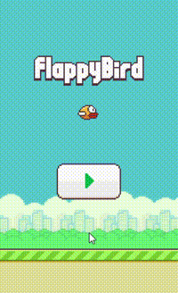
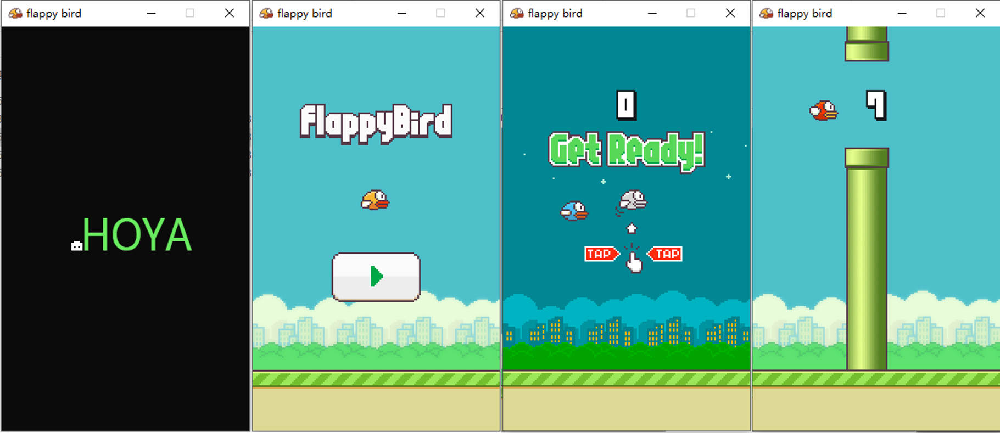

# Flappy Bird

2013年火爆一时的手游Flappy bird的Windows版实现，于2015年开发完成。

## 项目效果

动图如下：

截图如下：

## 运行环境

- Visual Studio 2013；

## 一些说明

- 克隆本仓库直接编译执行即可；
- 由于CxImage库只使用了Debug版本，因此程序在Debug版本下调试无异常，但在Release模式下会在程序结束时报错。
